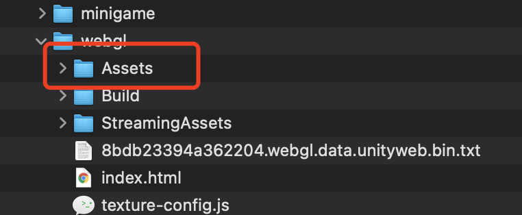

# 音频优化
由于导出成WEBGL的游戏，音频处理上存在一定的性能损耗，建议直接调用SDK中的音频API直接控制播放，能达到不错效果。使用微信音频API后音频无需再监听onAudioInterruptionBegin，onAudioInterruptionEnd事件，插件会自动处理。
## API使用
### 长音频的使用
代码如下，可参考[微信开发者文档](https://developers.weixin.qq.com/minigame/dev/api/media/audio/InnerAudioContext.html),其中src为音频地址，可填本地路径如 Assets/xx.wav，运行时会自动和配置的音频地址前缀做拼接得到最终线上地址。注意长音频使用时，音频对象是不还被缓存的，需要直接缓存音频对象（就是WX.CreateInnerAudioContext的对象需要自己缓存），不然每次都会重新加载。
* 使用方法一:

为了减少用户等待时间和避免音频延迟，
对于重要的音频可以等待`onCanplay`事件之后再调用`Play`播放。onCanplay事件是表示，当前音频已经可以播了，可以直接掉用`Play`，不会有延迟。而对于没那么重要的音频，允许部分延迟的，可以不等待onCanplay事件，而直接调用`Play`方法，这样音频就会边加载边播放，效果取决于用户网络，可能会稍微有点延迟。如果希望等音频全部加载了再播放，以及便于后续复用，避免后续延迟的话，可以在初始化是加上needDownload = true，
```
       // 第一次使用     
            var music = WX.CreateInnerAudioContext(new InnerAudioContextParam()
            {
                src = "Audio/0.wav",
                needDownload = true
            });
            music.OnCanplay(() =>
            {
                music.Play();
            });
            
        // 后续需要需要同时创建多个音频实例时，可以直接Play
                var music2 = WX.CreateInnerAudioContext(new InnerAudioContextParam()
                {
                    src = "Audio/0.wav"
                });
                music2.Play();    
```
* 使用方法二：
如果想直接将用到的音频先完全下载避免延迟，用到的时候直接使用，则可以如下调用：
```
            string[] a = { "Assets/Audio/0.wav", "Assets/Audio/1.wav" }; //需要预下载列表
            WX.PreDownloadAudios(a, (int res) =>
            {
                //下载完成后回调
                Debug.Log("Downloaded" + res);
                if (res == 0)
                {
                    //可以直接调用，无网络延迟
                    var music0 = WX.CreateInnerAudioContext(new InnerAudioContextParam()
                    {
                        src = "Audio/0.wav"
                    });
                    music0.Play();

                    var music1 = WX.CreateInnerAudioContext(new InnerAudioContextParam()
                    {
                        src = "Audio/1.wav"
                    });
                    music1.Play();
                }
            });
```
`注意` WX.CreateInnerAudioContext 返回的音频对象是可以复用的，就是可以多次调用Play方法播放，但是如果需要多个音频同时播放就要创建多个音频对象了。

### 短音频的使用
类似于Unity开发者喜欢更改AudioClip的方式来播放短音频，这里可以使用WX.ShortAudioPlayer来播放音频。音频对象会自动被缓存下来。便于后续播放`。（如果这里的方法不适合你的需求，那你还是可以按照长音频的方式来播放短音频。）可以参考如下代码：
```
// 这里是播放前预先加载Assets/music目录下的两个音频，来避免后续播放的音频播放延迟
WX.ShortAudioPlayer.PreLoadAudio(new string[] { "music/LowCrash.wav", "music/Brake2.wav" });

// 在需要播放的适合调用，不要暂停其他短音频，这里会自动停掉其他短音频，只播放这个端音频
WX.ShortAudioPlayer.StopOthersAndPlay("music/Brake2.wav", 1.0f,false);
```
## 导出设置
勾选使用微信音频API，并填上"游戏资源CDN"，比如填写的地址为https://wx.qq.com/data/ ，而API的src地址为 Assets/Audio/Chill_1.wav，则最终会请求 https://wx.qq.com/data/Assets/Audio/Chill_1.wav

 
## 将音频文件上传CDN
 游戏内的音频会被导出到导出目录的Assets文件夹下，需要将其上传至您的CDN，保证用户能访问到
 

