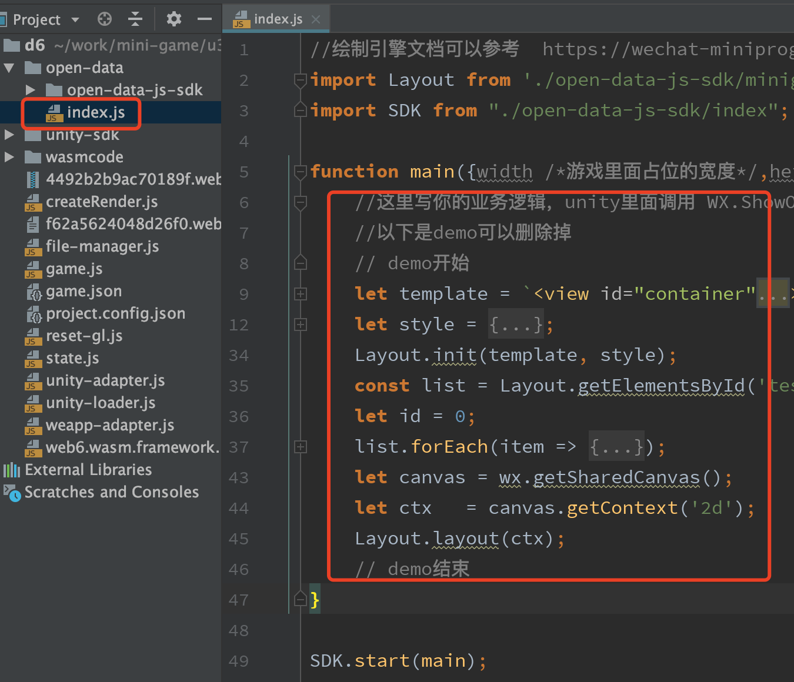

# Unity中如何展示排行榜这类微信关系数据

### 1、设置占位纹理
在游戏需要展示的地方创建一个RawImage,其中Texture属性自己选择透明的图片即可，后续展示时会被动态替换。因为unity纹理与web的绘制存在倒立的差异，请将先将 rotation的x 设置为180，即让 `UI控件延X轴旋转180度` 再调整到游戏中合适的位置,如下图

 
 
### 2、调用展示SDK的API 
在需要展示的地方调用，`WX.ShowOpenData`
```
WX.ShowOpenData(rawImage.texture, x, y, width, height);
```
其中 :
* x : 占位区域对应屏幕左上角横坐标
* y : 占位区域对应屏幕左上角纵坐标，注意左上角为（0，0）
* width : 占位区域对应的宽度
* height : 占位区域对应的高度

需要关闭时则调用，`WX.HideOpenData`。
如果需要再Unity中向开放域页面传递数据，可以调用`WX.GetOpenDataContext`，如下代码：
```
var c = WX.GetOpenDataContext();
c.PostMessage("hahaha哈哈");
```
开放域JS代码可以通过：
`wx.onMessage`接收
```
wx.onMessage(data => {
    console.log(data);
});
```
注意因为用户隐私问题，目前`只允许Unity向开放域发送通知`，开放域是不能向Unity里面发送通知的。
### 3、导出选项勾选使用好友关系链
 

### 4、用JS开发排行榜这类微信关系逻辑
在转化后的小游戏中的open-data/index.js 文件中写你对应的业务逻辑即可，如下图所示。 这里的JS开发我们提供了一个简单易上手的
[绘制引擎](https://wechat-miniprogram.github.io/minigame-canvas-engine/)，可以参看对应使用文档来绘制页面。而开放域的业务逻辑开发与普通小游戏的开放数据的开发没有差异，可以查看[官网](https://developers.weixin.qq.com/minigame/dev/guide/open-ability/open-data.html)做进一步了解。

 