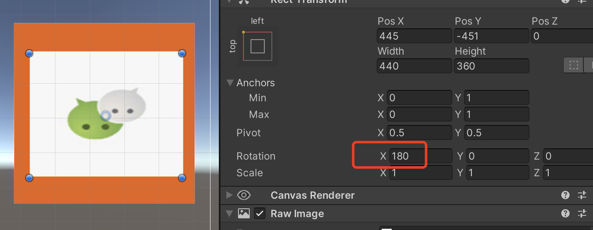

# Unity中如何展示排行榜这类微信关系数据

## 背景和原理介绍
小游戏提供了[一系列接口](https://developers.weixin.qq.com/minigame/dev/api/open-api/data/wx.shareMessageToFriend.html)获取好友关系链数据，为了安全，绝大部分接口都只能在[开放数据域](https://developers.weixin.qq.com/minigame/dev/guide/open-ability/opendata/basic.html)内调用。

 

开放数据域虽然乍一看有点复杂，但只需要核心理解几个点即可：
1. 开放数据域所有逻辑都在一个独立的文件夹内完成，它核心处理两件事：调用关系链接口拉好友数据和将数据绘制到 sharedCanvas；
2. 开放数据域接触到的 sharedCanvas 是一个离屏的 canvas，它完全不理解自己最终是怎么被绘制到屏幕上的；
3. 主域（其实就是开放数据域文件夹外的业务代码）同样能接触 sharedCanvas，一般是通过 sharedCanvas 创建精灵添加到游戏场景；
4. 数据的通信**一定是单向的**，只能从主域流向开放数据域，主域无法感知到开放数据域发生了什么；
5. 鉴于第4点，主域要更新 sharedCanvas 只能定期刷新纹理来实现同步开放数据域的变化；

Unity 里面要实现 sharedCanvas 的绘制，核心在于 hook Unity 的渲染，完整的原理为：
1. Unity 侧有个占位的纹理；
2. Unity WebGL 模式下这个占位纹理会对应有一个 WebGLObject，Unity 会调用 drawElements API 绘制到 canvas；
3. 在需要绘制排行榜的时候，将原本要绘制的 WebGLObject 替换成通过 sharedCanvas 创建而来的 WebGLObject；
4. 在关闭排行榜的时候，停止步骤 3 的 hook；

## 详细步骤
### 1、设置占位纹理
在游戏需要展示的地方创建一个 RawImage，其中 Texture 属性自己选择透明的图片即可，后续展示时会被动态替换。因为unity纹理与 Web 的绘制存在倒立的差异，请将先将 rotation的x 设置为180，即让 `UI控件延X轴旋转180度` 再调整到游戏中合适的位置,如下图

 
 
### 2、调用SDK的API 
#### 2.1 在需要展示的地方调用，`WX.ShowOpenData`
``` CSharp
WX.ShowOpenData(rawImage.texture, x, y, width, height);
```
其中 :
* x : 占位区域对应屏幕左上角横坐标
* y : 占位区域对应屏幕左上角纵坐标，注意左上角为（0，0）
* width : 占位区域对应的宽度
* height : 占位区域对应的高度

WX.ShowOpenData 最终会调用 minigame/unity-sdk/open-data.js 内的 WXShowOpenData 方法，核心是三个作用：
1. 调用 wx.getOpenDataContext，这会触发开放数据域的初始化，也就是 open-data 文件夹下的代码在开放数据域初始化之后才能够执行；
2. 给开放数据域侧抛一个事件，告知开放域去执行数据拉取和渲染操作，对于 WXRender 的处理没有任何要求，开放数据域甚至可以忽略这个事件；
``` js
openDataContext.postMessage({
    type: "WXRender",
    x: x,
    y: y,
    width: width,
    height: height,
    devicePixelRatio: window.devicePixelRatio,
});
```
3. 开始 hook Unity 的渲染，原本的 RawImage 就会被替换成 sharedCanvas 的纹理。

#### 2.2 需要关闭时则调用，`WX.HideOpenData`
这一步非常重要，如果仅仅在 Unity 侧隐藏了 RawImage 而没有调用 WX.HideOpenData，很可能导致排行榜关闭之后文理错乱，比如有些地方的纹理变成了排行榜对应的纹理。

#### 2.3 通过 PostMessage 向开放数据域传递消息

如果需要在 Unity 中向开放域页面传递数据，可以调用`WX.GetOpenDataContext`，如下代码：
``` CSharp
[System.Serializable]
public class OpenDataMessage
{
    // type 用于表明时间类型
    public string type;
}

OpenDataMessage msgData = new OpenDataMessage();
msgData.type = "showFriendsRank";
string msg = JsonUtility.ToJson(msgData);
WX.GetOpenDataContext().PostMessage(msg);
```
开放域JS代码可以通过：
``` js
wx.onMessage(data => {
  console.log("[WX OpenData] onMessage", data);

  if (typeof data === "string") {
    try {
      data = JSON.parse(data);
    } catch (e) {
      console.error("[WX OpenData] onMessage data is not a object");
      return;
    }
  }

  if (data.type === 'showFriendsRank') {
    // 执行好友排行榜渲染
  }
});
```

### 3、导出选项勾选使用好友关系链
这一步会做两个事情：
1. game.json 会声明使用开放数据域；
2. 将插件内置的 open-data 示例拷贝至 minigame 目录，请注意做好文件备份；

 

### 4、用JS开发排行榜这类微信关系逻辑
开放数据域的开发和普通小游戏并无区别，暂时只能通过 js 来开发，对技术选型并无要求，可以不依赖任何引擎调用 Canvas2D API 执行渲染，但如果需要事件点击、滚动列表等处理，就会显得很麻烦；也可以选择完整的 JS 游戏引擎比如 Cocos，但这会使得代码包明显增大进而影响启动速度。

因此插件内置的示例采用的是微信自研的[轻量级渲染引擎](https://wechat-miniprogram.github.io/minigame-canvas-engine/)，压缩后只有几十k，这需要你掌握一些简单的 Web 开发知识，包括 [Flex布局](https://www.ruanyifeng.com/blog/2015/07/flex-grammar.html)、[CSS](https://www.w3schools.com/css/)，参照示例修修改改很快能够上手。
 
### 5、示例DEMO
可以参考[Demo/Ranking/Assets](../Demo/Ranking/Assets)下面的Unity工程，对应导出的小游戏在[Demo/Ranking/MiniGame/minigame](../Demo/Ranking/MiniGame/minigame)下。

## 常见问题QA
**Q1. 为什么调用 WX.ShowOpenData 之后画面先黑一下再展示排行榜？**
A1. WX.ShowOpenData 在 openDataContext.postMessage WXRender 的事件之后立马就会开始 hook Unity 的渲染，如果开放数据域在监听到 WXRender 事件之后没有任何渲染行为，那么 sharedCanvas 纹理就还没有准备好，Unity 侧就可能出现黑一下的情况，解决办法是保证监听到 WXRender 事件之后有个同步的渲染行为，比如绘制个文案”好友数据加载中..."。

**Q2. 为什么我关闭排行榜之后界面上有些问题错乱了？**
A2. 基本上只可能是没调用 WX.HideOpenData，建议 WX.HideOpenData 打些日志来辅佐排查。

**Q3. 为什么开放数据域滚动事件不生效？**
A4. `WX.ShowOpenData(rawImage.texture, x, y, width, height)`的后面四个参数，核心目的是告诉开放数据域 sharedCanvas 最终被绘制在了屏幕的位置和尺寸，开放数据域才能够正确处理事件监听，遇到事件不生效的问题，首先排查传进来的参数是否符合预期，比如 x / y 不应该是负数。